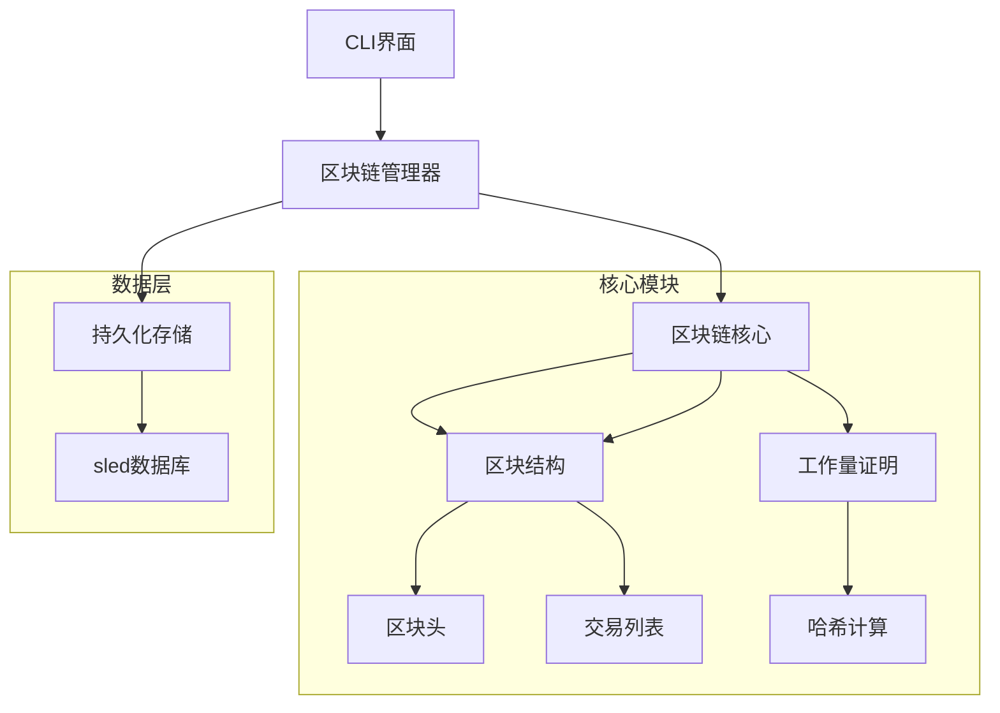

## 一、产品方案

### 1. 项目背景

本项目旨在实现一个基础区块链系统原型，用于演示区块链核心技术原理，包括分布式账本、工作量证明（PoW）、哈希链式结构、数据持久化等核心概念。目标用户为区块链技术学习者、教育机构及需要快速验证区块链原型的开发者。

### 2. 核心功能

| 功能模块   | 功能描述                                                       |
| -------- | ------------------------------------------------------------ |
| 创世块生成 | 自动创建包含初始交易的创世块，初始化区块链                        |
| 区块挖矿   | 支持通过调整 Nonce 值进行 PoW 挖矿，满足指定难度要求的哈希前缀            |
| 交易存储   | 支持存储文本型交易数据，每个区块可包含多个交易                         |
| 区块链可视化 | 命令行界面展示区块链完整结构（时间戳、哈希、Nonce、交易列表） |
| 数据持久化  | 使用嵌入式数据库实现区块链状态保存，支持重启后数据恢复                      |
| 完整性验证  | 通过哈希链式结构确保区块不可篡改                                     |

### 3. 用户场景

*   **教学演示：** 教师展示区块链核心机制，学生可直观观察挖矿过程及链式结构
*   **原型验证：** 开发者快速搭建测试环境，验证区块链相关算法改进方案
*   **研究实验：** 研究人员调整难度参数，测试不同配置下的区块链性能表现

## 二、技术方案

### 1. 系统架构



### 2. 模块设计

#### 2.1 BlockchainManager

*   **职责：** 区块链生命周期管理
*   **关键实现：**

```rust
impl BlockchainManager {
    // 初始化/加载区块链
    pub fn new(db_path: &str) -> Result<Self, Error> {
        let db = sled::open(db_path)?;
        // 反序列化逻辑...
    }

    // 状态持久化
    pub fn save(&self) -> Result<()> {
        let serialized = bincode::serialize(&self.blockchain)?;
        self.db.insert("blockchain", serialized)?;
    }
}
```

#### 2.2 Blockchain

*   **数据结构：**

```rust
pub struct Blockchain {
    pub chain: Vec<Block>,   // 区块链
    pub difficulty: u32,     // 当前难度
}
```

*   **核心方法：**
    *   `new()`: 初始化含创世块的区块链
    *   `add_block()`: 添加经过验证的新区块
    *   迭代器模式实现正向/反向遍历

#### 2.3 Block & BlockHeader

*   **区块结构：**

```rust
pub struct Block {
    pub header: BlockHeader,     // 区块头
    pub transactions: Vec<String>, // 交易数据
    pub hash: Vec<u8>,           // 当前哈希
}

pub struct BlockHeader {
    pub timestamp: u64,         // 时间戳
    pub prev_hash: Vec<u8>,     // 前驱哈希
    pub nonce: u64,             // 工作量证明
    pub difficulty: u32,        // 挖矿难度
}
```

*   **挖矿算法：**

```rust
fn mine(&mut self) {
    while !is_valid_hash(&self.hash, self.difficulty) {
        self.header.nonce += 1;
        self.hash = self.calculate_hash();
    }
}
```

### 3. 关键技术

*   **哈希算法：** SHA-256 保证数据指纹唯一性
*   **持久化方案：** sled 嵌入式 KV 数据库（ACID 特性）
*   **序列化：** bincode 二进制序列化协议
*   **难度控制：** 前 N 位零比特校验算法
